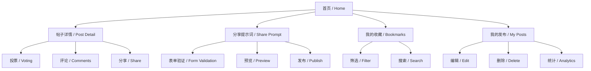
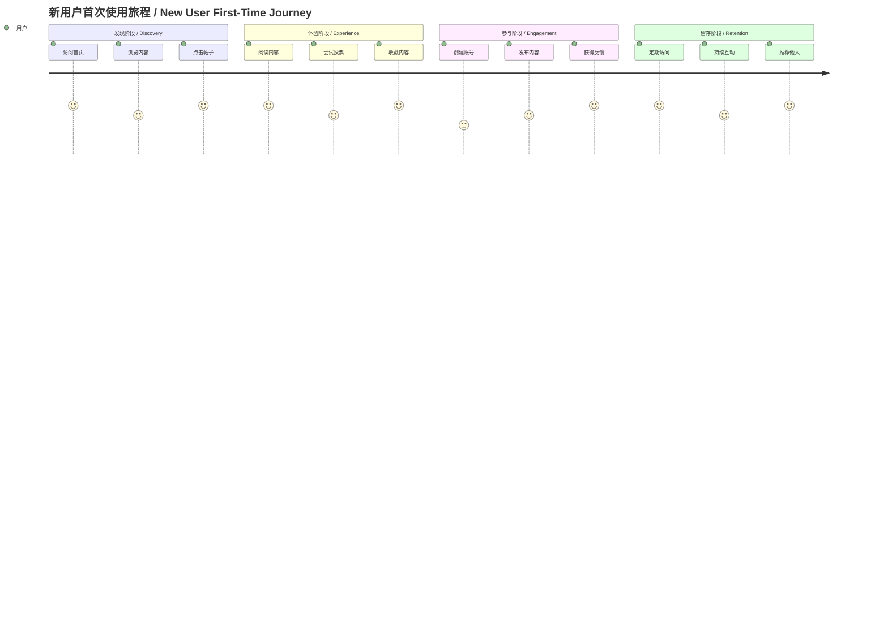
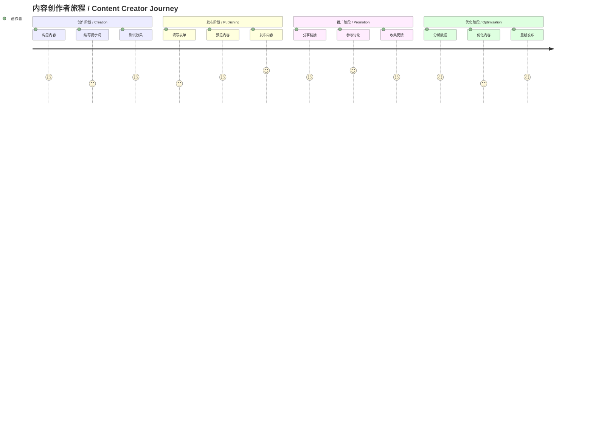
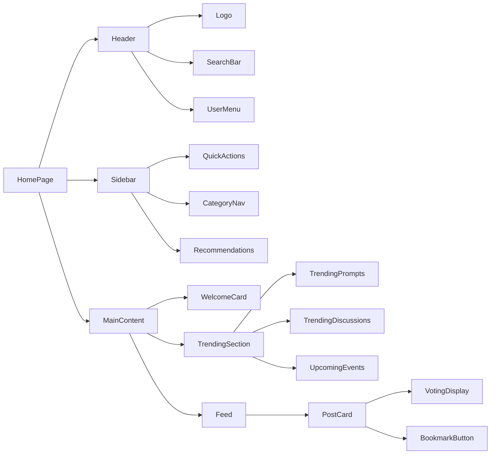

# UI/UX 信息架构设计 / UI/UX Information Architecture Design

## 项目概览 / Project Overview

**AI Community MVP v2** - 一个现代化的AI社区平台，专注于提示词分享、讨论和活动组织。

**AI Community MVP v2** - A modern AI community platform focused on prompt sharing, discussions, and event organization.

---

## 用户角色与目标 / User Roles & Goals

### 主要用户画像 / Primary User Personas

#### 1. 新手学习者 / Beginner Learner
- **目标**: 快速找到可用的高质量提示词
- **行为**: 浏览、收藏、学习
- **关键路径**: 发现 → 阅读 → 收藏 → 试用

#### 2. 提示词创作者 / Prompt Creator
- **目标**: 分享优质提示词，获得社区认可
- **行为**: 创作、发布、迭代、互动
- **关键路径**: 创作 → 发布 → 获得反馈 → 优化

#### 3. 社区活跃用户 / Active Community User
- **目标**: 参与讨论，发现新内容
- **行为**: 投票、评论、参与活动
- **关键路径**: 浏览 → 投票 → 评论 → 参与

---

## 信息架构层级 / Information Architecture Hierarchy

### 1. 主导航结构 / Main Navigation Structure

```
AI Community MVP v2
├── 🏠 首页 / Home
│   ├── 动态流 / Feed
│   ├── 趋势内容 / Trending
│   └── 快速操作 / Quick Actions
├── ✨ 分享提示词 / Share Prompt
│   ├── 创建新提示词 / Create New
│   └── 编辑提示词 / Edit Prompt
├── 📚 我的收藏 / My Bookmarks
│   ├── 已收藏内容 / Saved Content
│   └── 收藏分类 / Categories
├── 📝 我的发布 / My Posts
│   ├── 已发布内容 / Published Content
│   └── 草稿箱 / Drafts
└── 👤 用户中心 / User Center
    ├── 个人资料 / Profile
    ├── 设置 / Settings
    └── 帮助 / Help
```

### 2. 页面层级关系 / Page Hierarchy



---

## 用户旅程地图 / User Journey Map

### 新用户首次使用流程 / New User First-Time Flow



### 内容创作者流程 / Content Creator Flow



---

## 页面信息架构 / Page Information Architecture

### 1. 首页 / Homepage

#### 信息层级 / Information Hierarchy
```
首页 / Homepage
├── 顶部导航 / Top Navigation
│   ├── Logo / 品牌标识
│   ├── 搜索框 / Search Bar
│   └── 用户菜单 / User Menu
├── 主要内容区 / Main Content Area
│   ├── 欢迎卡片 / Welcome Card
│   ├── 趋势内容 / Trending Content
│   │   ├── 热门提示词 / Trending Prompts
│   │   ├── 热门讨论 / Trending Discussions
│   │   └── 即将开始的活动 / Upcoming Events
│   └── 动态流 / Feed
│       ├── 帖子卡片 / Post Cards
│       └── 分页控制 / Pagination
└── 侧边栏 / Sidebar
    ├── 快速操作 / Quick Actions
    ├── 分类导航 / Category Navigation
    └── 推荐内容 / Recommended Content
```

#### 组件关系图 / Component Relationship


### 2. 帖子详情页 / Post Detail Page

#### 信息层级 / Information Hierarchy
```
帖子详情页 / Post Detail Page
├── 顶部导航 / Top Navigation
│   ├── 返回按钮 / Back Button
│   ├── 分享按钮 / Share Button
│   └── 更多操作 / More Actions
├── 主要内容 / Main Content
│   ├── 帖子头部 / Post Header
│   │   ├── 标题 / Title
│   │   ├── 作者信息 / Author Info
│   │   └── 发布时间 / Publish Time
│   ├── 帖子内容 / Post Content
│   │   ├── 提示词内容 / Prompt Content
│   │   ├── 示例输出 / Example Output
│   │   └── 使用说明 / Usage Instructions
│   └── 互动区域 / Interaction Area
│       ├── 投票组件 / Voting Component
│       ├── 收藏按钮 / Bookmark Button
│       └── 分享按钮 / Share Button
├── 评论区 / Comments Section
│   ├── 评论列表 / Comments List
│   ├── 评论表单 / Comment Form
│   └── 分页控制 / Pagination
└── 相关推荐 / Related Recommendations
    ├── 相似内容 / Similar Content
    └── 作者其他作品 / Author's Other Works
```

### 3. 分享提示词页面 / Share Prompt Page

#### 信息层级 / Information Hierarchy
```
分享提示词页面 / Share Prompt Page
├── 页面头部 / Page Header
│   ├── 标题 / Title
│   └── 进度指示器 / Progress Indicator
├── 表单区域 / Form Area
│   ├── 基本信息 / Basic Information
│   │   ├── 提示词标题 / Prompt Title
│   │   ├── 提示词内容 / Prompt Content
│   │   └── 标签 / Tags
│   ├── 详细描述 / Detailed Description
│   │   ├── 使用场景 / Use Case
│   │   ├── 预期效果 / Expected Results
│   │   └── 注意事项 / Notes
│   └── 示例展示 / Example Display
│       ├── 输入示例 / Input Example
│       └── 输出示例 / Output Example
├── 预览区域 / Preview Area
│   ├── 实时预览 / Live Preview
│   └── 效果展示 / Effect Display
└── 操作按钮 / Action Buttons
    ├── 保存草稿 / Save Draft
    ├── 预览 / Preview
    └── 发布 / Publish
```

---

## 组件设计系统 / Component Design System

### 1. 原子组件 / Atomic Components

#### 按钮组件 / Button Components
```
Button
├── Primary Button / 主要按钮
│   ├── 大尺寸 / Large
│   ├── 中尺寸 / Medium
│   └── 小尺寸 / Small
├── Secondary Button / 次要按钮
├── Ghost Button / 幽灵按钮
└── Icon Button / 图标按钮
```

#### 卡片组件 / Card Components
```
Card
├── Post Card / 帖子卡片
│   ├── 标题 / Title
│   ├── 内容预览 / Content Preview
│   ├── 元数据 / Metadata
│   └── 操作按钮 / Action Buttons
├── User Card / 用户卡片
├── Event Card / 活动卡片
└── Stat Card / 统计卡片
```

### 2. 分子组件 / Molecular Components

#### 投票组件 / Voting Component
```
VotingDisplay
├── 投票按钮 / Vote Buttons
│   ├── 赞成按钮 / Upvote Button
│   └── 反对按钮 / Downvote Button
├── 票数显示 / Vote Count Display
├── 投票状态 / Vote Status
└── 趋势指示器 / Trend Indicator
```

#### 搜索组件 / Search Component
```
SearchBar
├── 输入框 / Input Field
├── 搜索按钮 / Search Button
├── 筛选选项 / Filter Options
└── 搜索结果 / Search Results
```

### 3. 有机体组件 / Organism Components

#### 导航组件 / Navigation Component
```
Sidebar
├── 用户信息 / User Info
├── 导航菜单 / Navigation Menu
├── 快速操作 / Quick Actions
└── 推荐内容 / Recommended Content
```

#### 内容流组件 / Content Feed Component
```
Feed
├── 筛选器 / Filter
├── 排序选项 / Sort Options
├── 内容列表 / Content List
└── 分页控制 / Pagination
```

---

## 交互设计模式 / Interaction Design Patterns

### 1. 导航模式 / Navigation Patterns

#### 主导航 / Main Navigation
- **位置**: 左侧固定侧边栏
- **状态**: 始终可见，响应式折叠
- **交互**: 悬停高亮，点击激活

#### 面包屑导航 / Breadcrumb Navigation
- **位置**: 页面顶部
- **用途**: 显示当前位置，快速返回
- **样式**: 简洁文本链接

### 2. 内容展示模式 / Content Display Patterns

#### 卡片布局 / Card Layout
- **用途**: 展示帖子、用户、活动
- **特点**: 统一尺寸，清晰层次
- **交互**: 悬停效果，点击跳转

#### 列表布局 / List Layout
- **用途**: 展示搜索结果、用户列表
- **特点**: 紧凑排列，信息密度高
- **交互**: 行悬停，批量操作

### 3. 表单交互模式 / Form Interaction Patterns

#### 分步表单 / Multi-step Form
- **用途**: 复杂内容创建
- **特点**: 分步引导，减少认知负担
- **交互**: 进度指示，步骤验证

#### 实时验证 / Real-time Validation
- **用途**: 表单输入验证
- **特点**: 即时反馈，错误提示
- **交互**: 输入时验证，提交前检查

---

## 响应式设计策略 / Responsive Design Strategy

### 断点设置 / Breakpoint Settings
```
Mobile: 320px - 768px
├── 单列布局 / Single Column
├── 简化导航 / Simplified Navigation
└── 触摸优化 / Touch Optimized

Tablet: 768px - 1024px
├── 双列布局 / Two Column
├── 侧边栏折叠 / Collapsible Sidebar
└── 混合交互 / Mixed Interaction

Desktop: 1024px+
├── 多列布局 / Multi Column
├── 完整侧边栏 / Full Sidebar
└── 悬停效果 / Hover Effects
```

### 组件适配 / Component Adaptation
- **导航**: 移动端抽屉式，桌面端固定侧边栏
- **卡片**: 移动端单列，桌面端多列网格
- **表单**: 移动端垂直布局，桌面端水平布局

---

## 可访问性设计 / Accessibility Design

### 1. 视觉可访问性 / Visual Accessibility
- **对比度**: 符合WCAG 2.1 AA标准
- **字体大小**: 最小14px，支持缩放
- **颜色**: 不仅依赖颜色传达信息

### 2. 交互可访问性 / Interaction Accessibility
- **键盘导航**: 支持Tab键导航
- **焦点管理**: 清晰的焦点指示器
- **屏幕阅读器**: 语义化HTML标签

### 3. 认知可访问性 / Cognitive Accessibility
- **清晰标签**: 描述性的按钮和链接文本
- **错误处理**: 清晰的错误信息和恢复建议
- **一致性**: 统一的交互模式和视觉语言

---

## 性能优化策略 / Performance Optimization Strategy

### 1. 加载性能 / Loading Performance
- **代码分割**: 按路由分割JavaScript包
- **懒加载**: 图片和组件按需加载
- **预加载**: 关键资源预加载

### 2. 运行时性能 / Runtime Performance
- **虚拟滚动**: 长列表虚拟化
- **防抖节流**: 搜索和滚动事件优化
- **缓存策略**: 合理的数据缓存

### 3. 用户体验优化 / UX Optimization
- **骨架屏**: 加载状态可视化
- **渐进式加载**: 内容分层加载
- **离线支持**: 基础功能离线可用

---

## 设计规范 / Design Specifications

### 1. 颜色系统 / Color System
```
Primary Colors / 主色调
├── 主色: #3B82F6 (Blue-500)
├── 主色深: #1E40AF (Blue-800)
└── 主色浅: #DBEAFE (Blue-100)

Neutral Colors / 中性色
├── 文字主色: #111827 (Gray-900)
├── 文字次色: #6B7280 (Gray-500)
├── 背景色: #FFFFFF (White)
└── 边框色: #E5E7EB (Gray-200)

Semantic Colors / 语义色
├── 成功: #10B981 (Emerald-500)
├── 警告: #F59E0B (Amber-500)
├── 错误: #EF4444 (Red-500)
└── 信息: #3B82F6 (Blue-500)
```

### 2. 字体系统 / Typography System
```
Heading Fonts / 标题字体
├── H1: 32px / 2rem, 700 weight
├── H2: 24px / 1.5rem, 600 weight
├── H3: 20px / 1.25rem, 600 weight
└── H4: 18px / 1.125rem, 500 weight

Body Fonts / 正文字体
├── Large: 18px / 1.125rem, 400 weight
├── Medium: 16px / 1rem, 400 weight
├── Small: 14px / 0.875rem, 400 weight
└── Caption: 12px / 0.75rem, 400 weight
```

### 3. 间距系统 / Spacing System
```
Spacing Scale / 间距比例
├── 0: 0px
├── 1: 4px
├── 2: 8px
├── 3: 12px
├── 4: 16px
├── 5: 20px
├── 6: 24px
├── 8: 32px
├── 10: 40px
├── 12: 48px
├── 16: 64px
└── 20: 80px
```

---

## 总结 / Summary

本信息架构设计为AI社区MVP v2提供了完整的UI/UX设计指导，包括：

This information architecture design provides comprehensive UI/UX design guidance for AI Community MVP v2, including:

- **用户中心设计**: 基于真实用户需求的功能规划
- **清晰的信息层级**: 直观的导航和内容组织
- **一致的交互模式**: 统一的用户体验标准
- **响应式设计**: 多设备适配策略
- **可访问性考虑**: 包容性设计原则
- **性能优化**: 快速响应的用户体验

**User-centered design**: Feature planning based on real user needs
**Clear information hierarchy**: Intuitive navigation and content organization
**Consistent interaction patterns**: Unified user experience standards
**Responsive design**: Multi-device adaptation strategy
**Accessibility considerations**: Inclusive design principles
**Performance optimization**: Fast and responsive user experience

---

**文档版本**: v1.0  
**最后更新**: 2025年1月  
**维护者**: AI Community MVP v2 设计团队
