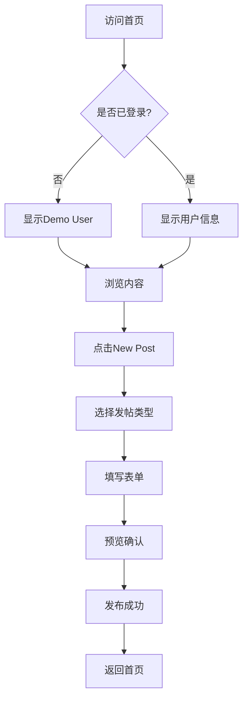
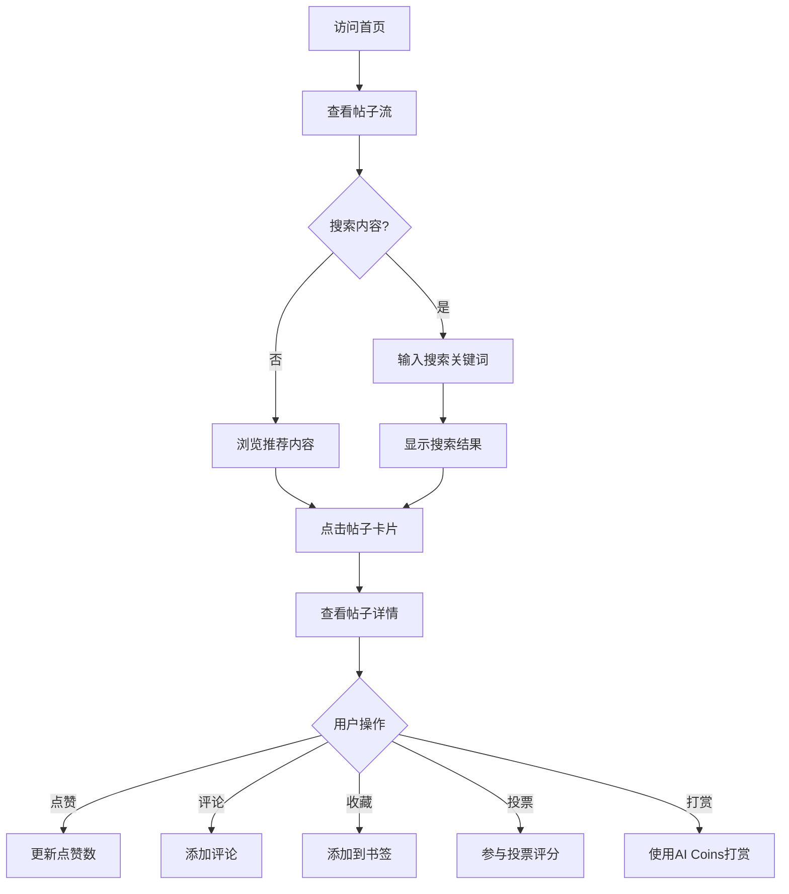
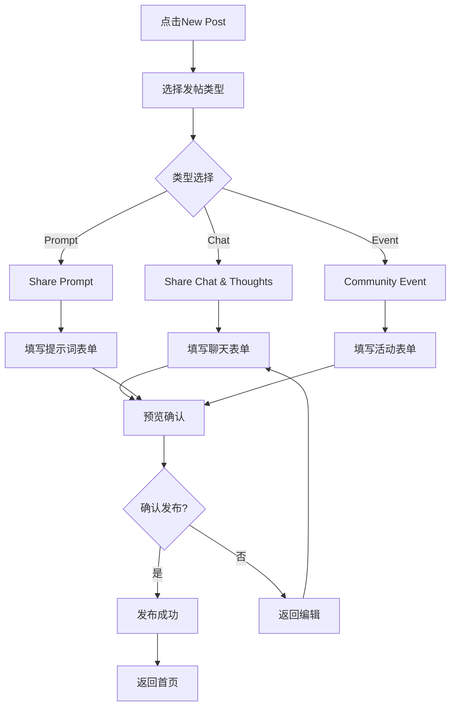

# AI Community MVP v2 - 用户体验设计 / User Experience Design

## 🎯 用户流程 (User Flow) / User Flow

### 新用户注册流程 / New User Registration Flow



### 内容发现流程 / Content Discovery Flow



### 发帖流程 / Posting Flow



## 🛣️ 用户旅程 (User Journey) / User Journey

### 新用户首次体验 / First-time User Experience

#### 阶段1: 发现和进入 / Stage 1: Discovery and Entry

**时间**: 0-2分钟 / **Time**: 0-2 minutes

**用户行为**: / **User Actions**:
- 通过搜索引擎或推荐访问网站 / Access website through search engine or recommendation
- 看到简洁现代的黑白界面 / See clean and modern black and white interface
- 浏览首页的帖子流 / Browse homepage post feed

**情感状态**: / **Emotional State**:
- 好奇和期待 / Curious and expectant
- 对界面设计的第一印象 / First impression of interface design

**关键触点**: / **Key Touchpoints**:
- 首页视觉设计 / Homepage visual design
- 帖子卡片布局 / Post card layout
- 导航菜单 / Navigation menu

#### 阶段2: 探索和了解 / Stage 2: Exploration and Understanding

**时间**: 2-5分钟 / **Time**: 2-5 minutes

**用户行为**: / **User Actions**:
- 点击查看不同类型的帖子 / Click to view different types of posts
- 阅读帖子详情内容 / Read post detail content
- 尝试搜索功能 / Try search functionality
- 浏览侧边栏功能 / Browse sidebar features

**情感状态**: / **Emotional State**:
- 逐渐熟悉界面 / Gradually familiar with interface
- 对功能的好奇 / Curiosity about features

**关键触点**: / **Key Touchpoints**:
- 帖子详情页 / Post detail page
- 搜索和过滤功能 / Search and filter functionality
- 侧边栏导航 / Sidebar navigation

#### 阶段3: 首次参与 / Stage 3: First Participation

**时间**: 5-10分钟 / **Time**: 5-10 minutes

**用户行为**: / **User Actions**:
- 尝试点赞或评论 / Try liking or commenting
- 收藏感兴趣的帖子 / Bookmark interesting posts
- 点击"New Post"按钮 / Click "New Post" button
- 选择发帖类型 / Select post type

**情感状态**: / **Emotional State**:
- 开始参与感 / Beginning to feel engaged
- 对发帖功能的期待 / Anticipation for posting features

**关键触点**: / **Key Touchpoints**:
- 互动按钮 / Interaction buttons
- 发帖入口 / Posting entry
- 确认对话框 / Confirmation dialogs

#### 阶段4: 创建内容 / Stage 4: Content Creation

**时间**: 10-20分钟 / **Time**: 10-20 minutes

**用户行为**: / **User Actions**:
- 填写发帖表单 / Fill posting form
- 添加标签和描述 / Add tags and descriptions
- 预览内容 / Preview content
- 发布第一个帖子 / Publish first post

**情感状态**: / **Emotional State**:
- 专注和投入 / Focused and engaged
- 对发布结果的期待 / Anticipation for publishing results

**关键触点**: / **Key Touchpoints**:
- 发帖表单界面 / Posting form interface
- 预览功能 / Preview functionality
- 发布确认 / Publishing confirmation

#### 阶段5: 获得反馈 / Stage 5: Receiving Feedback

**时间**: 20-30分钟 / **Time**: 20-30 minutes

**用户行为**: / **User Actions**:
- 查看发布结果 / View publishing results
- 检查个人中心 / Check personal center
- 等待社区反馈 / Wait for community feedback
- 浏览其他用户的内容 / Browse other users' content

**情感状态**: / **Emotional State**:
- 成就感 / Sense of achievement
- 对社区反馈的期待 / Anticipation for community feedback

**关键触点**: / **Key Touchpoints**:
- 个人中心 / Personal center
- 社区反馈 / Community feedback
- 通知系统 / Notification system

### 活跃用户日常使用 / Active User Daily Usage

#### 早晨浏览 / Morning Browsing

**时间**: 5-10分钟 / **Time**: 5-10 minutes

**用户行为**: / **User Actions**:
- 查看热门内容 / Check trending content
- 浏览新发布的帖子 / Browse newly published posts
- 检查个人消息和通知 / Check personal messages and notifications
- 快速点赞或收藏 / Quick likes or bookmarks

**情感状态**: / **Emotional State**:
- 轻松和愉悦 / Relaxed and pleasant
- 对新内容的期待 / Anticipation for new content

#### 深度参与 / Deep Engagement

**时间**: 15-30分钟 / **Time**: 15-30 minutes

**用户行为**: / **User Actions**:
- 详细阅读感兴趣的帖子 / Read interesting posts in detail
- 参与评论和讨论 / Participate in comments and discussions
- 为提示词投票评分 / Vote and rate prompts
- 分享优质内容 / Share quality content

**情感状态**: / **Emotional State**:
- 专注和思考 / Focused and thoughtful
- 社区归属感 / Sense of community belonging

#### 内容创作 / Content Creation

**时间**: 20-45分钟 / **Time**: 20-45 minutes

**用户行为**: / **User Actions**:
- 创建新的帖子 / Create new posts
- 分享AI对话经验 / Share AI conversation experiences
- 发布提示词技巧 / Publish prompt techniques
- 组织社区活动 / Organize community events

**情感状态**: / **Emotional State**:
- 创造性和成就感 / Creative and accomplished
- 对分享价值的认同 / Recognition of sharing value

## 🏗️ 信息架构 (Information Architecture) / Information Architecture

### 主导航结构 / Main Navigation Structure

```
AI Community MVP v2
├── 首页 (Homepage) /
│   ├── 帖子流 (Post Feed)
│   ├── 搜索栏 (Search Bar)
│   ├── 分类入口 (Category Entries)
│   │   ├── Trending Prompts
│   │   ├── Trending Posts
│   │   └── Events
│   └── 新发帖按钮 (New Post Button)
│
├── 发帖 (Posting) /
│   ├── 选择类型 (Type Selection)
│   ├── 填写表单 (Form Filling)
│   ├── 预览确认 (Preview Confirmation)
│   └── 发布成功 (Publishing Success)
│
├── 帖子详情 (Post Details) /
│   ├── 内容展示 (Content Display)
│   ├── 互动功能 (Interaction Features)
│   │   ├── 点赞 (Like)
│   │   ├── 评论 (Comment)
│   │   ├── 收藏 (Bookmark)
│   │   ├── 投票 (Vote) - 仅提示词
│   │   └── 打赏 (Tip) - 仅提示词
│   └── 相关推荐 (Related Recommendations)
│
├── 热门内容 (Trending) /
│   ├── Trending Prompts
│   ├── Trending Posts
│   └── Events
│
├── 个人中心 (Personal Center) /
│   ├── 我的发布 (My Posts)
│   ├── 书签收藏 (Bookmarks)
│   ├── AI Coins余额 (AI Coins Balance)
│   └── 个人设置 (Personal Settings)
│
└── 帮助和支持 (Help & Support) /
    ├── 新手指南 (Beginner Guide)
    ├── 社区安全 (Community Safety)
    └── 联系支持 (Contact Support)
```

### 内容分类体系 / Content Classification System

#### 按帖子类型分类 / Classification by Post Type

```
帖子类型 (Post Types)
├── Share Chat & Thoughts (分享对话和思考)
│   ├── 日常对话 (Daily Conversations)
│   ├── 问题求助 (Problem Solving)
│   ├── 经验分享 (Experience Sharing)
│   └── 创意展示 (Creative Showcase)
│
├── Share Prompt (分享提示词)
│   ├── 营销类 (Marketing)
│   ├── 写作类 (Writing)
│   ├── 编程类 (Programming)
│   ├── 教育类 (Education)
│   └── 创意类 (Creative)
│
└── Community Event (社区活动)
    ├── 线上讲座 (Online Lectures)
    ├── 直播活动 (Live Events)
    ├── 协作项目 (Collaboration Projects)
    └── 社区聚会 (Community Meetups)
```

#### 按标签分类 / Classification by Tags

```
标签体系 (Tag System)
├── 技术标签 (Technical Tags)
│   ├── AI工具 (AI Tools)
│   ├── 编程语言 (Programming Languages)
│   ├── 框架技术 (Framework Technologies)
│   └── 开发工具 (Development Tools)
│
├── 领域标签 (Domain Tags)
│   ├── 商业 (Business)
│   ├── 教育 (Education)
│   ├── 创意 (Creative)
│   ├── 科研 (Research)
│   └── 娱乐 (Entertainment)
│
├── 难度标签 (Difficulty Tags)
│   ├── 初学者 (Beginner)
│   ├── 中级 (Intermediate)
│   └── 高级 (Advanced)
│
└── 状态标签 (Status Tags)
    ├── 热门 (Trending)
    ├── 最新 (Latest)
    ├── 推荐 (Recommended)
    └── 精华 (Featured)
```

### 用户权限体系 / User Permission System

```
用户角色 (User Roles)
├── 访客 (Visitor)
│   ├── 浏览内容 (Browse Content)
│   ├── 搜索功能 (Search Function)
│   └── 查看详情 (View Details)
│
├── 注册用户 (Registered User)
│   ├── 所有访客权限 (All Visitor Permissions)
│   ├── 发布内容 (Publish Content)
│   ├── 互动功能 (Interaction Features)
│   ├── 个人中心 (Personal Center)
│   └── 收藏管理 (Bookmark Management)
│
└── 高级用户 (Premium User)
    ├── 所有注册用户权限 (All Registered User Permissions)
    ├── 高级搜索 (Advanced Search)
    ├── 优先推荐 (Priority Recommendations)
    ├── 专属标签 (Exclusive Tags)
    └── 高级分析 (Advanced Analytics)
```

## 🎨 界面层次结构 / Interface Hierarchy

### 视觉层次 / Visual Hierarchy

```
界面层次 (Interface Levels)
├── 主要层次 (Primary Level)
│   ├── 导航栏 (Navigation Bar)
│   ├── 主要内容区 (Main Content Area)
│   └── 侧边栏 (Sidebar)
│
├── 次要层次 (Secondary Level)
│   ├── 帖子卡片 (Post Cards)
│   ├── 搜索栏 (Search Bar)
│   ├── 分类入口 (Category Entries)
│   └── 用户信息 (User Information)
│
├── 第三层次 (Tertiary Level)
│   ├── 标签 (Tags)
│   ├── 统计信息 (Statistics)
│   ├── 操作按钮 (Action Buttons)
│   └── 时间戳 (Timestamps)
│
└── 第四层次 (Quaternary Level)
    ├── 图标 (Icons)
    ├── 状态指示器 (Status Indicators)
    ├── 微交互 (Micro-interactions)
    └── 装饰元素 (Decorative Elements)
```

### 信息密度 / Information Density

```
信息密度层级 (Information Density Levels)
├── 高密度 (High Density)
│   ├── 帖子列表页 (Post List Page)
│   ├── 搜索结果页 (Search Results Page)
│   └── 热门内容页 (Trending Content Page)
│
├── 中密度 (Medium Density)
│   ├── 首页 (Homepage)
│   ├── 个人中心 (Personal Center)
│   └── 分类浏览页 (Category Browse Page)
│
├── 低密度 (Low Density)
│   ├── 帖子详情页 (Post Detail Page)
│   ├── 发帖页面 (Posting Page)
│   └── 设置页面 (Settings Page)
│
└── 极低密度 (Very Low Density)
    ├── 欢迎页面 (Welcome Page)
    ├── 错误页面 (Error Page)
    └── 加载页面 (Loading Page)
```

## 🔄 交互模式 / Interaction Patterns

### 导航模式 / Navigation Patterns

```
导航模式 (Navigation Patterns)
├── 主导航 (Main Navigation)
│   ├── 顶部导航栏 (Top Navigation Bar)
│   ├── 侧边栏导航 (Sidebar Navigation)
│   └── 面包屑导航 (Breadcrumb Navigation)
│
├── 内容导航 (Content Navigation)
│   ├── 分页导航 (Pagination Navigation)
│   ├── 无限滚动 (Infinite Scroll)
│   └── 标签过滤 (Tag Filtering)
│
├── 功能导航 (Feature Navigation)
│   ├── 下拉菜单 (Dropdown Menu)
│   ├── 模态框 (Modal Dialog)
│   └── 侧滑面板 (Slide-out Panel)
│
└── 深度链接 (Deep Linking)
    ├── URL参数 (URL Parameters)
    ├── 书签支持 (Bookmark Support)
    └── 分享链接 (Share Links)
```

### 反馈模式 / Feedback Patterns

```
反馈模式 (Feedback Patterns)
├── 即时反馈 (Immediate Feedback)
│   ├── 悬停效果 (Hover Effects)
│   ├── 点击反馈 (Click Feedback)
│   └── 状态变化 (State Changes)
│
├── 操作反馈 (Action Feedback)
│   ├── 成功提示 (Success Messages)
│   ├── 错误提示 (Error Messages)
│   └── 警告提示 (Warning Messages)
│
├── 进度反馈 (Progress Feedback)
│   ├── 加载状态 (Loading States)
│   ├── 进度条 (Progress Bars)
│   └── 骨架屏 (Skeleton Screens)
│
└── 确认反馈 (Confirmation Feedback)
    ├── 确认对话框 (Confirmation Dialogs)
    ├── 撤销操作 (Undo Actions)
    └── 操作历史 (Action History)
```

## 📱 响应式设计 / Responsive Design

### 断点系统 / Breakpoint System

```
响应式断点 (Responsive Breakpoints)
├── 移动端 (Mobile)
│   ├── 320px - 767px
│   ├── 单列布局 (Single Column Layout)
│   ├── 触摸优化 (Touch Optimization)
│   └── 简化导航 (Simplified Navigation)
│
├── 平板端 (Tablet)
│   ├── 768px - 1023px
│   ├── 双列布局 (Two Column Layout)
│   ├── 混合交互 (Mixed Interaction)
│   └── 适配导航 (Adaptive Navigation)
│
├── 桌面端 (Desktop)
│   ├── 1024px - 1439px
│   ├── 多列布局 (Multi Column Layout)
│   ├── 鼠标交互 (Mouse Interaction)
│   └── 完整功能 (Full Features)
│
└── 大屏端 (Large Screen)
    ├── 1440px+
    ├── 宽屏布局 (Wide Screen Layout)
    ├── 高级功能 (Advanced Features)
    └── 多任务支持 (Multi-tasking Support)
```

### 内容适配 / Content Adaptation

```
内容适配策略 (Content Adaptation Strategies)
├── 文本适配 (Text Adaptation)
│   ├── 字体大小调整 (Font Size Adjustment)
│   ├── 行高优化 (Line Height Optimization)
│   └── 字符截断 (Character Truncation)
│
├── 图片适配 (Image Adaptation)
│   ├── 响应式图片 (Responsive Images)
│   ├── 懒加载 (Lazy Loading)
│   └── 格式优化 (Format Optimization)
│
├── 布局适配 (Layout Adaptation)
│   ├── 弹性网格 (Flexible Grid)
│   ├── 流式布局 (Fluid Layout)
│   └── 自适应组件 (Adaptive Components)
│
└── 交互适配 (Interaction Adaptation)
    ├── 触摸手势 (Touch Gestures)
    ├── 键盘导航 (Keyboard Navigation)
    └── 语音控制 (Voice Control)
```

## 🎯 用户体验指标 / User Experience Metrics

### 关键指标 / Key Metrics

```
用户体验指标 (User Experience Metrics)
├── 可用性指标 (Usability Metrics)
│   ├── 任务完成率 (Task Completion Rate)
│   ├── 错误率 (Error Rate)
│   ├── 学习时间 (Learning Time)
│   └── 满意度评分 (Satisfaction Score)
│
├── 性能指标 (Performance Metrics)
│   ├── 页面加载时间 (Page Load Time)
│   ├── 交互响应时间 (Interaction Response Time)
│   ├── 动画流畅度 (Animation Smoothness)
│   └── 内存使用率 (Memory Usage)
│
├── 参与度指标 (Engagement Metrics)
│   ├── 会话时长 (Session Duration)
│   ├── 页面浏览量 (Page Views)
│   ├── 用户留存率 (User Retention Rate)
│   └── 内容参与度 (Content Engagement)
│
└── 转化率指标 (Conversion Metrics)
    ├── 注册转化率 (Registration Conversion Rate)
    ├── 发帖转化率 (Posting Conversion Rate)
    ├── 付费转化率 (Payment Conversion Rate)
    └── 推荐转化率 (Referral Conversion Rate)
```

---

**文档版本**: v1.0 / **Document Version**: v1.0
**最后更新**: 2024年1月 / **Last Updated**: January 2024
**状态**: 完成 / **Status**: Complete
