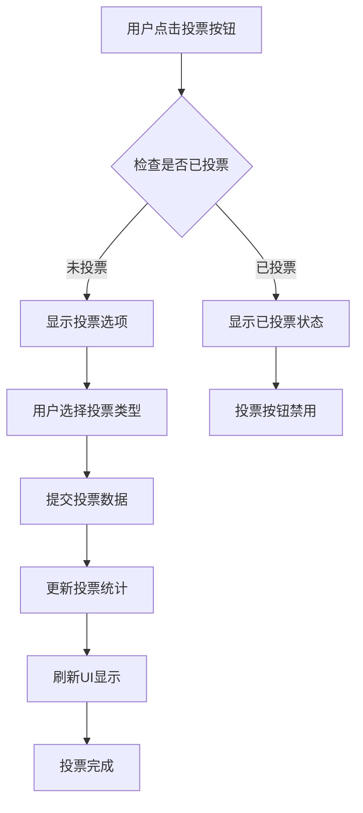
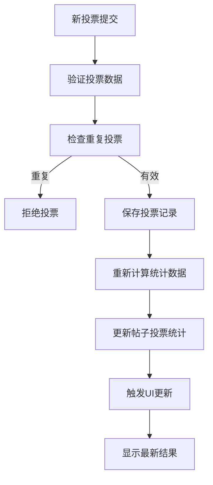
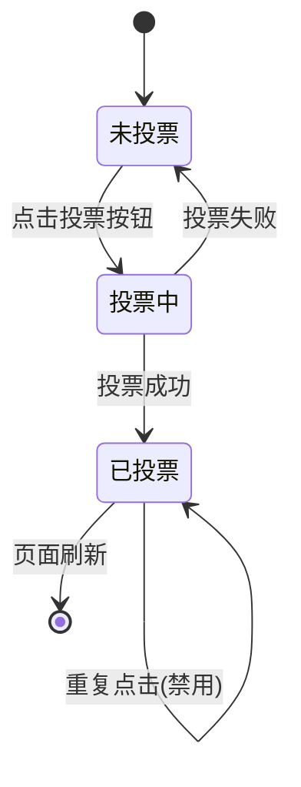

# 投票系统文档 / Voting System Documentation

## 概述 / Overview

AI社区MVP v2的投票系统是一个核心功能，允许用户对提示词分享帖子进行投票，通过社区参与来评估和推广高质量的提示词内容。

The voting system in AI Community MVP v2 is a core feature that allows users to vote on prompt sharing posts, evaluating and promoting high-quality prompt content through community engagement.

## 系统架构 / System Architecture

### 数据模型 / Data Models

#### Vote 接口 / Vote Interface
```typescript
interface Vote {
  id: string;           // 投票唯一标识
  postId: string;       // 被投票的帖子ID
  userId: string;       // 投票用户ID
  voteType: 'upvote' | 'downvote';  // 投票类型
  timestamp: number;    // 投票时间戳
}
```

#### Post 投票统计 / Post Voting Statistics
```typescript
interface VotingStats {
  totalVotes: number;           // 总投票数
  upvotes: number;             // 赞成票数
  downvotes: number;           // 反对票数
  voteBreakdown: {             // 投票分类统计
    [key: string]: number;     // 按分类统计的投票数
  };
}
```

### 核心功能 / Core Functions

#### 1. 投票提交 / Vote Submission
- **函数**: `submitVote(postId: string, voteType: 'upvote' | 'downvote')`
- **功能**: 用户对指定帖子进行投票
- **限制**: 每个用户对同一帖子只能投票一次
- **返回**: 更新后的投票统计

#### 2. 投票统计更新 / Voting Statistics Update
- **函数**: `updatePostVotingStats(postId: string, newVote: Vote)`
- **功能**: 实时更新帖子的投票统计数据
- **计算**: 重新计算总投票数、赞成票、反对票

#### 3. 投票状态检查 / Vote Status Check
- **函数**: `hasUserVoted(postId: string, userId: string)`
- **功能**: 检查用户是否已对指定帖子投票
- **用途**: 防止重复投票，控制UI状态

## 用户旅程 / User Journey

### 1. 发现投票内容 / Discovering Voteable Content
```
用户进入首页 → 浏览提示词分享帖子 → 看到投票按钮和当前票数
User enters homepage → Browses prompt sharing posts → Sees vote button and current count
```

### 2. 投票决策过程 / Voting Decision Process
```
查看帖子详情 → 阅读提示词内容 → 评估质量 → 决定是否投票
View post details → Read prompt content → Evaluate quality → Decide whether to vote
```

### 3. 执行投票 / Executing Vote
```
点击投票按钮 → 系统检查投票状态 → 提交投票 → 更新统计数据 → 刷新UI
Click vote button → System checks vote status → Submit vote → Update statistics → Refresh UI
```

### 4. 查看投票结果 / Viewing Vote Results
```
投票完成 → 看到更新的票数 → 帖子排名可能发生变化
Vote completed → See updated count → Post ranking may change
```

## 流程图 / Flow Diagrams

### 投票流程 / Voting Flow



### 数据更新流程 / Data Update Flow



### 投票状态管理 / Vote Status Management



## 技术实现细节 / Technical Implementation

### 存储机制 / Storage Mechanism
- **本地存储**: 使用 `localStorage` 存储投票数据
- **数据持久化**: 投票记录和统计数据持久保存
- **数据同步**: 实时更新投票统计，确保数据一致性

### 防重复投票 / Duplicate Vote Prevention
- **用户检查**: 每次投票前检查用户是否已投票
- **UI状态**: 已投票用户看到禁用的投票按钮
- **数据验证**: 后端验证确保数据完整性

### 实时更新 / Real-time Updates
- **即时反馈**: 投票后立即更新UI显示
- **统计重算**: 每次投票后重新计算所有统计数据
- **状态同步**: 确保所有组件显示一致的投票状态

## 用户体验设计 / User Experience Design

### 视觉反馈 / Visual Feedback
- **投票按钮**: 清晰显示投票状态和选项
- **票数显示**: 实时显示当前投票统计
- **状态指示**: 已投票状态有明显的视觉区分

### 交互设计 / Interaction Design
- **一键投票**: 简化的投票操作流程
- **即时响应**: 投票操作立即生效
- **错误处理**: 友好的错误提示和恢复机制

### 性能优化 / Performance Optimization
- **本地缓存**: 减少重复数据请求
- **增量更新**: 只更新变化的数据
- **异步处理**: 非阻塞的投票操作

## 数据统计 / Data Analytics

### 投票指标 / Voting Metrics
- **总投票数**: 所有帖子的投票总数
- **平均投票率**: 每个帖子的平均投票数
- **用户参与度**: 参与投票的用户比例
- **热门内容**: 获得最多投票的帖子

### 趋势分析 / Trend Analysis
- **投票趋势**: 投票数量的时间变化
- **内容偏好**: 用户偏好的内容类型
- **参与模式**: 用户的投票行为模式

## 未来扩展 / Future Enhancements

### 功能扩展 / Feature Extensions
- **投票权重**: 根据用户等级设置投票权重
- **投票历史**: 用户投票历史记录
- **投票理由**: 允许用户添加投票评论
- **批量投票**: 支持批量投票操作

### 技术改进 / Technical Improvements
- **服务端存储**: 迁移到服务端数据库
- **实时同步**: 多用户实时投票同步
- **数据分析**: 更深入的投票数据分析
- **API接口**: 标准化的投票API接口

## 测试用例 / Test Cases

### 功能测试 / Functional Tests
1. **正常投票流程**: 用户成功投票并看到结果更新
2. **重复投票防护**: 防止用户对同一帖子重复投票
3. **数据一致性**: 确保投票数据统计准确
4. **UI状态同步**: 投票后UI状态正确更新

### 边界测试 / Edge Cases
1. **空数据投票**: 处理空或无效的投票数据
2. **网络异常**: 处理网络连接问题
3. **并发投票**: 处理多用户同时投票
4. **数据恢复**: 处理数据丢失或损坏

---

**文档版本**: v1.0  
**最后更新**: 2025年1月  
**维护者**: AI Community MVP v2 开发团队
