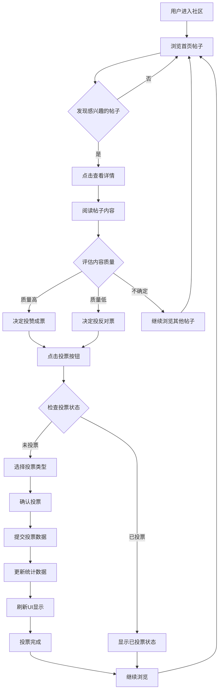

# 投票系统用户旅程图 / Voting System User Journey

## 用户旅程概览 / User Journey Overview

本文档详细描述了用户在AI社区MVP v2中与投票系统交互的完整旅程，包括所有可能的路径和决策点。

This document details the complete user journey for interacting with the voting system in AI Community MVP v2, including all possible paths and decision points.

## 主要用户角色 / Main User Roles

### 1. 新用户 / New User
- 首次访问社区
- 对投票系统不熟悉
- 需要引导和说明

### 2. 活跃用户 / Active User
- 熟悉社区功能
- 经常参与投票
- 了解投票规则

### 3. 内容创作者 / Content Creator
- 发布提示词内容
- 关注自己内容的投票情况
- 希望获得社区认可

## 详细用户旅程 / Detailed User Journey

### 阶段1: 发现投票机会 / Stage 1: Discovering Voting Opportunities

#### 1.1 首页浏览 / Homepage Browsing
```
用户进入首页
↓
看到提示词分享帖子列表
↓
注意到帖子上的投票按钮和票数显示
↓
产生投票兴趣
```

**关键元素 / Key Elements:**
- 投票按钮可见性
- 当前票数显示
- 帖子质量预览

#### 1.2 帖子详情查看 / Post Detail View
```
点击进入帖子详情页
↓
阅读完整的提示词内容
↓
查看示例输出
↓
评估内容质量
↓
决定是否投票
```

**决策点 / Decision Points:**
- 内容是否对我有用？
- 提示词质量如何？
- 是否值得推荐给其他人？

### 阶段2: 投票决策过程 / Stage 2: Voting Decision Process

#### 2.1 质量评估 / Quality Assessment
```
阅读提示词标题
↓
查看提示词介绍
↓
分析提示词内容
↓
检查示例输出
↓
评估整体质量
```

**评估标准 / Evaluation Criteria:**
- 清晰度和可理解性
- 实用性和适用性
- 创新性和独特性
- 完整性和准确性

#### 2.2 投票类型选择 / Vote Type Selection
```
决定投票
↓
选择投票类型
├── 赞成票 (Upvote)
│   └── 内容质量高，值得推荐
└── 反对票 (Downvote)
    └── 内容质量低，不推荐
```

**投票动机 / Voting Motivations:**
- **赞成票**: 内容有用、质量高、创新性强
- **反对票**: 内容低质、误导性、重复内容

### 阶段3: 执行投票 / Stage 3: Executing Vote

#### 3.1 投票操作 / Voting Action
```
点击投票按钮
↓
系统检查投票状态
├── 已投票 → 显示已投票状态
└── 未投票 → 显示投票选项
    ↓
    选择投票类型
    ↓
    确认投票
    ↓
    提交投票数据
```

#### 3.2 投票反馈 / Voting Feedback
```
投票提交成功
↓
系统更新统计数据
↓
UI显示最新票数
↓
投票按钮状态更新
↓
用户看到投票结果
```

### 阶段4: 投票后体验 / Stage 4: Post-Vote Experience

#### 4.1 即时反馈 / Immediate Feedback
```
投票完成
↓
看到更新的票数
↓
投票按钮变为已投票状态
↓
可能看到排名变化
```

#### 4.2 持续关注 / Ongoing Engagement
```
继续浏览其他帖子
↓
可能发现更多投票机会
↓
关注自己投票的帖子
↓
查看社区投票趋势
```

## 用户旅程流程图 / User Journey Flow Diagram



## 关键决策点分析 / Key Decision Point Analysis

### 决策点1: 是否投票 / Decision Point 1: Whether to Vote
**影响因素 / Influencing Factors:**
- 内容相关性
- 质量评估
- 个人偏好
- 时间投入

**用户行为 / User Behavior:**
- 快速浏览 → 快速决策
- 详细阅读 → 慎重决策
- 跳过不感兴趣的内容

### 决策点2: 投票类型选择 / Decision Point 2: Vote Type Selection
**赞成票条件 / Upvote Conditions:**
- 内容有用且实用
- 质量高且专业
- 创新性强
- 格式规范

**反对票条件 / Downvote Conditions:**
- 内容质量低
- 信息不准确
- 重复或抄袭
- 格式混乱

## 用户体验优化建议 / UX Optimization Recommendations

### 1. 投票引导 / Voting Guidance
- **新用户引导**: 首次投票时的操作说明
- **投票提示**: 解释投票的意义和影响
- **质量标准**: 提供投票评估标准

### 2. 反馈机制 / Feedback Mechanisms
- **即时反馈**: 投票后立即显示结果
- **状态指示**: 清晰的投票状态显示
- **错误处理**: 友好的错误提示

### 3. 激励机制 / Incentive Mechanisms
- **投票奖励**: 投票获得AI币奖励
- **贡献认可**: 显示用户的投票贡献
- **社区地位**: 基于投票参与度的用户等级

## 数据收集点 / Data Collection Points

### 用户行为数据 / User Behavior Data
- 投票频率
- 投票类型偏好
- 浏览时间
- 决策路径

### 内容质量数据 / Content Quality Data
- 投票分布
- 平均票数
- 投票趋势
- 热门内容

### 系统性能数据 / System Performance Data
- 投票响应时间
- 错误率
- 用户满意度
- 系统稳定性

## 未来改进方向 / Future Improvement Directions

### 短期改进 / Short-term Improvements
- 优化投票按钮设计
- 增加投票引导
- 改进错误处理
- 增强反馈机制

### 长期规划 / Long-term Planning
- 引入投票权重系统
- 添加投票评论功能
- 实现智能推荐
- 建立投票分析系统

---

**文档版本**: v1.0  
**最后更新**: 2025年1月  
**用途**: 流程图绘制、用户旅程设计、产品优化参考
