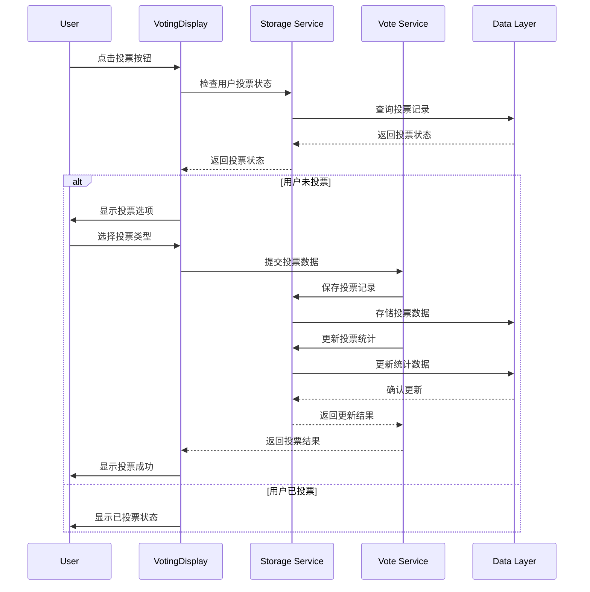
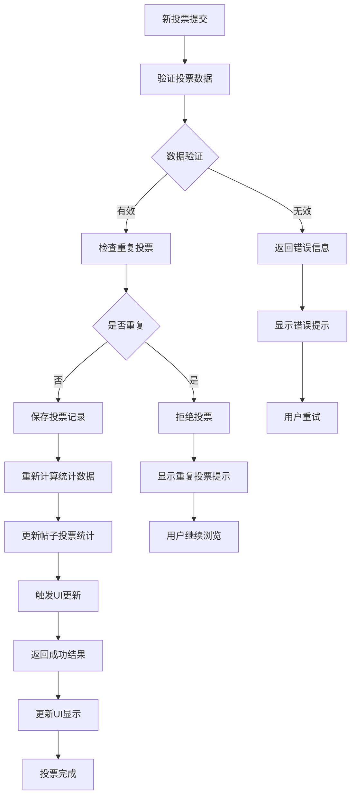
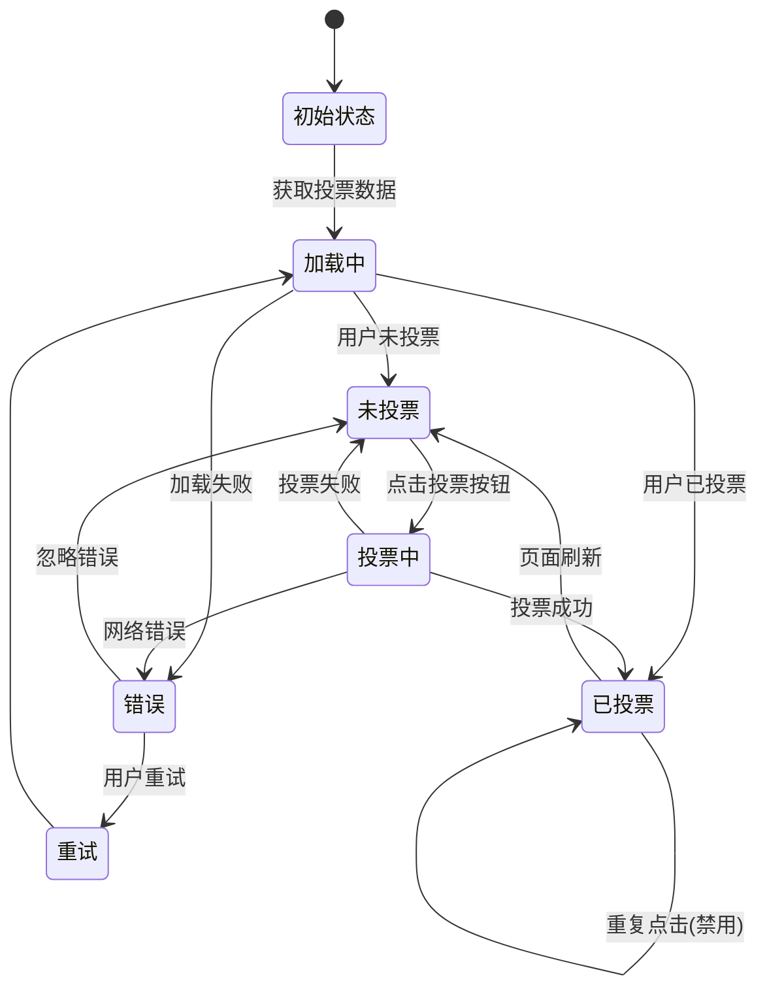
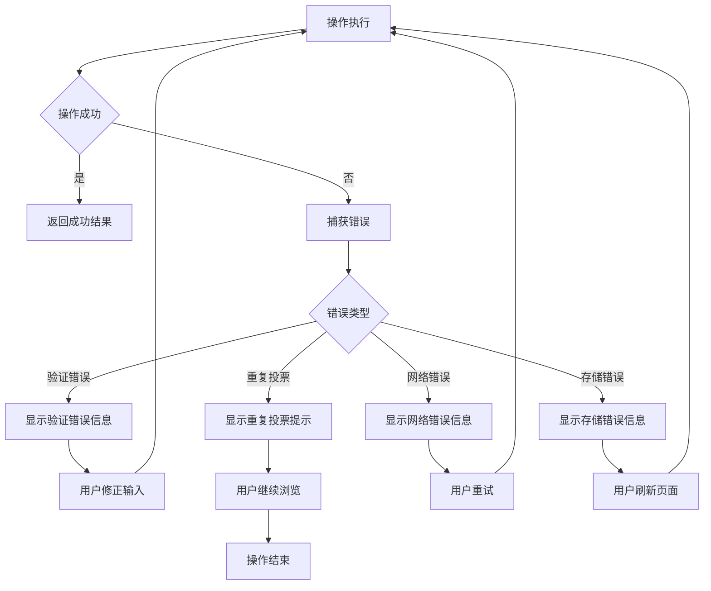

# 投票系统技术流程图 / Voting System Technical Flow

## 技术架构概览 / Technical Architecture Overview

本文档详细描述了AI社区MVP v2投票系统的技术实现流程，包括数据流、API调用、状态管理和错误处理。

This document details the technical implementation flow of the voting system in AI Community MVP v2, including data flow, API calls, state management, and error handling.

## 系统组件 / System Components

### 前端组件 / Frontend Components
- **VotingDisplay**: 投票显示和交互组件
- **PostCard**: 帖子卡片，包含投票按钮
- **PostDetail**: 帖子详情页，显示投票统计

### 后端服务 / Backend Services
- **Storage Service**: 本地存储管理
- **Vote Service**: 投票逻辑处理
- **Statistics Service**: 统计数据计算

### 数据层 / Data Layer
- **localStorage**: 客户端数据存储
- **Vote Records**: 投票记录存储
- **Post Statistics**: 帖子统计数据

## 技术流程图 / Technical Flow Diagrams

### 1. 投票提交流程 / Vote Submission Flow



### 2. 数据更新流程 / Data Update Flow



### 3. 状态管理流程 / State Management Flow



## 核心函数实现 / Core Function Implementation

### 1. 投票提交函数 / Vote Submission Function

```typescript
/**
 * 提交投票
 * @param postId 帖子ID
 * @param voteType 投票类型
 * @returns 投票结果
 */
async function submitVote(postId: string, voteType: 'upvote' | 'downvote'): Promise<VoteResult> {
  try {
    // 1. 验证输入参数
    if (!postId || !voteType) {
      throw new Error('Invalid vote parameters');
    }
    
    // 2. 检查用户是否已投票
    const hasVoted = storage.hasUserVoted(postId, currentUser.id);
    if (hasVoted) {
      return { success: false, message: 'User has already voted' };
    }
    
    // 3. 创建投票记录
    const vote: Vote = {
      id: generateVoteId(),
      postId,
      userId: currentUser.id,
      voteType,
      timestamp: Date.now()
    };
    
    // 4. 保存投票记录
    await storage.addVote(vote);
    
    // 5. 更新投票统计
    await storage.updatePostVotingStats(postId, vote);
    
    // 6. 返回成功结果
    return { success: true, vote };
    
  } catch (error) {
    console.error('Vote submission failed:', error);
    return { success: false, message: error.message };
  }
}
```

### 2. 投票统计更新函数 / Voting Statistics Update Function

```typescript
/**
 * 更新帖子投票统计
 * @param postId 帖子ID
 * @param newVote 新投票记录
 */
async function updatePostVotingStats(postId: string, newVote: Vote): Promise<void> {
  try {
    // 1. 获取所有投票记录
    const allVotes = storage.getVotes();
    const postVotes = allVotes.filter(vote => vote.postId === postId);
    
    // 2. 计算统计数据
    const stats: VotingStats = {
      totalVotes: postVotes.length,
      upvotes: postVotes.filter(v => v.voteType === 'upvote').length,
      downvotes: postVotes.filter(v => v.voteType === 'downvote').length,
      voteBreakdown: calculateVoteBreakdown(postVotes)
    };
    
    // 3. 更新帖子数据
    const post = storage.getPost(postId);
    if (post) {
      post.votingStats = stats;
      storage.updatePost(post);
    }
    
  } catch (error) {
    console.error('Failed to update voting stats:', error);
    throw error;
  }
}
```

### 3. 投票状态检查函数 / Vote Status Check Function

```typescript
/**
 * 检查用户是否已投票
 * @param postId 帖子ID
 * @param userId 用户ID
 * @returns 是否已投票
 */
function hasUserVoted(postId: string, userId: string): boolean {
  try {
    const votes = storage.getVotes();
    return votes.some(vote => 
      vote.postId === postId && 
      vote.userId === userId
    );
  } catch (error) {
    console.error('Failed to check vote status:', error);
    return false;
  }
}
```

## 错误处理机制 / Error Handling Mechanism

### 1. 错误类型定义 / Error Type Definitions

```typescript
interface VotingError {
  type: 'VALIDATION_ERROR' | 'DUPLICATE_VOTE' | 'NETWORK_ERROR' | 'STORAGE_ERROR';
  message: string;
  code: string;
  details?: any;
}
```

### 2. 错误处理流程 / Error Handling Flow



### 3. 错误恢复策略 / Error Recovery Strategies

- **验证错误**: 提供修正建议，允许用户重新输入
- **重复投票**: 显示已投票状态，引导用户继续浏览
- **网络错误**: 提供重试按钮，自动重试机制
- **存储错误**: 提示用户刷新页面，保存用户输入

## 性能优化策略 / Performance Optimization Strategies

### 1. 数据缓存 / Data Caching

```typescript
// 投票数据缓存
const voteCache = new Map<string, Vote[]>();

// 统计数据缓存
const statsCache = new Map<string, VotingStats>();

// 缓存更新策略
function updateCache(postId: string, newVote: Vote) {
  // 更新投票缓存
  const votes = voteCache.get(postId) || [];
  votes.push(newVote);
  voteCache.set(postId, votes);
  
  // 更新统计缓存
  const stats = calculateStats(votes);
  statsCache.set(postId, stats);
}
```

### 2. 异步处理 / Asynchronous Processing

```typescript
// 异步投票提交
async function submitVoteAsync(postId: string, voteType: string) {
  // 立即更新UI
  updateUIOptimistically(postId, voteType);
  
  try {
    // 异步提交到服务器
    const result = await submitVoteToServer(postId, voteType);
    
    // 更新UI状态
    updateUIWithResult(result);
    
  } catch (error) {
    // 回滚UI状态
    rollbackUI(postId);
    showError(error);
  }
}
```

### 3. 批量更新 / Batch Updates

```typescript
// 批量更新投票统计
function batchUpdateStats(updates: VoteUpdate[]) {
  const batch = updates.reduce((acc, update) => {
    const postId = update.postId;
    if (!acc[postId]) {
      acc[postId] = [];
    }
    acc[postId].push(update);
    return acc;
  }, {});
  
  // 批量处理更新
  Object.keys(batch).forEach(postId => {
    updatePostVotingStats(postId, batch[postId]);
  });
}
```

## 测试策略 / Testing Strategy

### 1. 单元测试 / Unit Tests

```typescript
describe('Voting System', () => {
  test('should submit vote successfully', async () => {
    const result = await submitVote('post1', 'upvote');
    expect(result.success).toBe(true);
  });
  
  test('should prevent duplicate votes', async () => {
    await submitVote('post1', 'upvote');
    const result = await submitVote('post1', 'downvote');
    expect(result.success).toBe(false);
  });
  
  test('should update statistics correctly', async () => {
    await submitVote('post1', 'upvote');
    const stats = getPostVotingStats('post1');
    expect(stats.upvotes).toBe(1);
  });
});
```

### 2. 集成测试 / Integration Tests

```typescript
describe('Voting Integration', () => {
  test('should handle complete voting flow', async () => {
    // 1. 用户点击投票按钮
    const button = screen.getByRole('button', { name: /vote/i });
    fireEvent.click(button);
    
    // 2. 选择投票类型
    const upvoteButton = screen.getByRole('button', { name: /upvote/i });
    fireEvent.click(upvoteButton);
    
    // 3. 验证UI更新
    expect(screen.getByText('Vote submitted')).toBeInTheDocument();
    expect(screen.getByText('1 vote')).toBeInTheDocument();
  });
});
```

### 3. 性能测试 / Performance Tests

```typescript
describe('Voting Performance', () => {
  test('should handle multiple votes efficiently', async () => {
    const startTime = performance.now();
    
    // 提交100个投票
    const promises = Array.from({ length: 100 }, (_, i) => 
      submitVote(`post${i}`, 'upvote')
    );
    
    await Promise.all(promises);
    
    const endTime = performance.now();
    expect(endTime - startTime).toBeLessThan(1000); // 1秒内完成
  });
});
```

## 监控和日志 / Monitoring and Logging

### 1. 关键指标监控 / Key Metrics Monitoring

- **投票成功率**: 成功投票 / 总投票尝试
- **响应时间**: 投票提交到UI更新的时间
- **错误率**: 投票失败的比例
- **用户参与度**: 参与投票的用户比例

### 2. 日志记录 / Logging

```typescript
// 投票操作日志
function logVoteAction(action: string, data: any) {
  console.log({
    timestamp: new Date().toISOString(),
    action,
    data,
    userId: getCurrentUser().id,
    sessionId: getSessionId()
  });
}

// 错误日志
function logError(error: Error, context: any) {
  console.error({
    timestamp: new Date().toISOString(),
    error: error.message,
    stack: error.stack,
    context,
    userId: getCurrentUser().id
  });
}
```

---

**文档版本**: v1.0  
**最后更新**: 2025年1月  
**用途**: 技术实现、代码开发、系统维护参考

